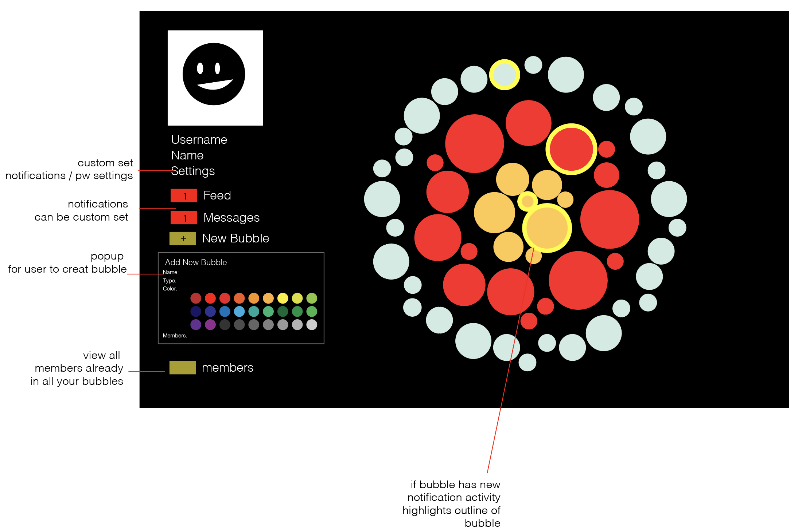
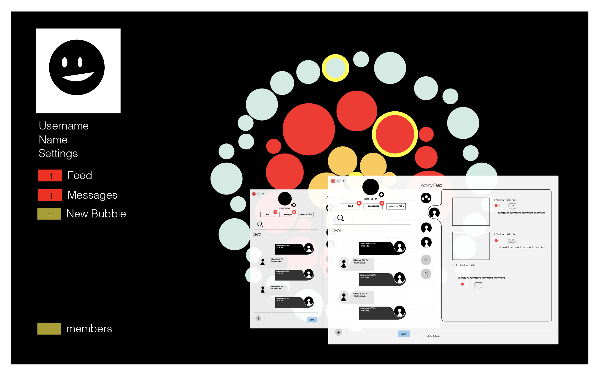
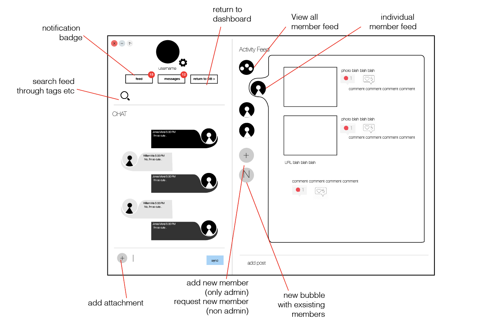

# Bubbles

## Bubbles : The Anti-Social Media App 

o Unlike Facebook and Instagram, Bubbles is a social media application which allows users to connect within the Bubbles community without requiring profiles to have centralized content and friend list. 

o With Bubbles, each user can create multiple “bubbles”. A single bubble contains a localized friend list and shared content. Each bubble can be categorized in a color coded group, such as friends, families, coworkers etc. No other user will be able to see your bubbles. 

o Within each bubble, a user can participate in a group chat and feed, where they can share images, URLs, and videos for all members to view. 

## Why Use Bubbles? 
o Unlike other social media applications, Bubbles emphasize and stress the importance of User privacy. 

## Privacy and Intimacy 
o Each user's profile and bubbles are kept private. Users cannot search for other user profiles, or join other bubbles without admin invitation. 

o Joining Bubbles is easy. Only an email and age verification is required, no further information is needed. 

## Inspiration 

o As the anti-social media app, Bubbles is commited to providing users with a personal way to connect with friends and family without compromising the user's privacy. We do not believe in selling user data and aim to keep the user's experience as intimiate and secure as possible. We value the user's right in keeping their information and connections personal. 

## Features 

### User Dashboard: 

### User Feed / Chat: 

## Members 

Jonas - Front-End 
Luis - Back-end models / posts
William - Back-end login /reg 
Aman -  back-end chat 
Alicia - UX/UI / front-end